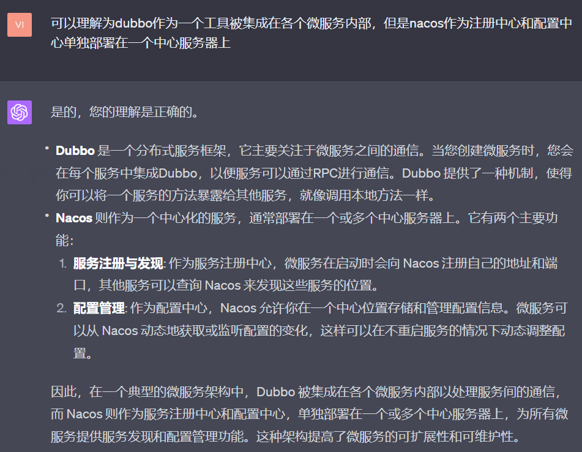
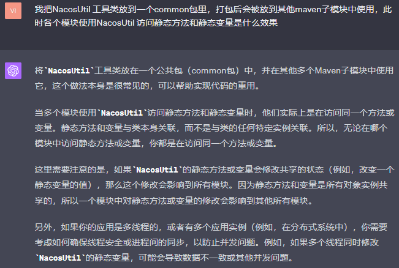

# 手写一个RPC框架

## 设计一个rpc框架应该考虑些什么?


补充：一个rpc框架应该能支持不同的web服务容器，比如支持tomcat，netty，jetty等服务器

## dubbo和nacos

### dubbo作为一个分布式系统的rpc通信框架，与nacos有什么区别？


### 可以理解为dubbo作为一个工具被集成在各个微服务内部，但是nacos作为注册中心和配置中心单独部署在一个中心服务器上


### nacos作为注册中心，其中的内容都是nacos注册中心的副本，起到了一个缓存的作用对吗？


# 弄清楚rpc的基础知识
## rpc是什么，到底有什么作用？
> 全称是remote process call，远程过程调用，但是在java里面没有
> 过程的概念，也可以称为远程方法调用，顾名思义，就是A服务调用B服务的
> 某一个业务方法的过程就称为rpc。
## 为什么需要rpc框架？
> 如果不使用rpc框架，A服务调用B服务就需要程序员在A本地写调用过程的代码，
> 这样做没问题，但是如果A服务在许多地方调用B服务的方法，或者说一个系统中
> 有几百个这样的调用，那么就需要重复写几百次调用方法。
> 所以如果有一个统一的rpc框架，一旦涉及到服务调用只需要使用这个调用框架
> 就可以了，而不需要重写调用方法。

## 如何使用rpc框架？
各个模块如果想要使用rpc框架，就需要导入相应的依赖，
rpc框架本身是一个工具，但是这个工具会创建一个tomcat类似的
web容器

## 为什么服务的实现类和接口要分开到两个模块


## 服务注册和发现的过程是由rpc完成的吗


## 当微服务A使用rpc框架调用服务B时会进行哪些操作


## rpc框架与tomcat服务器

### rpc框架为什么会用到tomcat之类的服务器呢
> 我们知道一个rpc框架需要有服务注册、服务发现以及服务调用的能力，这就决定了它需要有收发请
> 求的能力，所以就需要有一个web服务器比如tomcat（tomcat提供收发请求的能力）

### 可不可以认为一个微服务使用rpc框架时，rpc框架进行服务注册和发现以及调用使用的tomcat和微服务用到的是同一个


## 为什么这里的rpc是基于HTTP协议的？
请注意，虽然Tomcat是用于基于HTTP的RPC服务的
常见选择，但RPC不一定要基于HTTP。还有其他的RPC
协议和实现，如gRPC，它通常使用HTTP/2作为传输层
协议，但不依赖于像Tomcat这样的Web服务器。

## 微服务
### 作为微服务的一个集群，里面每一个实例都可以提供服务，那是不是存在主从节点，从节点提供读，主负责写


# 疑问：
## DispatchServlet分发可以使用哪些设计模式
### 如何使用的责任链/过滤器模式
推荐看下面这篇文章：[责任链设计模式详解](https://juejin.cn/post/6990340204150128653)

### 如何使用“调度器模式”实现分发？
当然可以。在实际的应用中，Dispatcher 可以直接根据参数的不同将请求分发给不同的处理器，这种模式通常被称为
“调度器模式”或者直接作为一种策略的实现。在这种模式下，Dispatcher 具有路由逻辑，负责将请求映射到相应的处理器。
```java
public interface Handler {
    void handleRequest(Request request);
    boolean canHandle(Request request);
}

public class HandlerA implements Handler {
    @Override
    public void handleRequest(Request request) {
        // 处理逻辑
    }

    @Override
    public boolean canHandle(Request request) {
        // 判断是否可以处理该请求
        return request.getType().equals("TypeA");
    }
}

public class HandlerB implements Handler {
    @Override
    public void handleRequest(Request request) {
        // 处理逻辑
    }

    @Override
    public boolean canHandle(Request request) {
        // 判断是否可以处理该请求
        return request.getType().equals("TypeB");
    }
}

public class Dispatcher {
    private List<Handler> handlers;

    public Dispatcher() {
        // 初始化处理器列表
        this.handlers = new ArrayList<>();
        this.handlers.add(new HandlerA());
        this.handlers.add(new HandlerB());
    }

    public void dispatch(Request request) {
        // 根据请求的参数分发给不同的处理器
        for (Handler handler : handlers) {
            if (handler.canHandle(request)) {
                handler.handleRequest(request);
                return;
            }
        }
    }
}

```

### 为什么我会觉得“调度器模式”会比责任链模式在处理请求方面更加高效呢？

您的直觉是有根据的。通常情况下，“调度器模式”在处理请求时确实可能比“责任链模式”更加高效。这主要是因为以下几个原因：

1. **直接映射**: 在“调度器模式”中，Dispatcher通常具有明确的逻辑来直接将请求映射到适当的处理器。这通常可以通过哈希映射、查找表或简单的条件语句来完成。这意味着在找到正确的处理器时，通常只需要很少的步骤。

2. **避免不必要的遍历**: 相比之下，“责任链模式”通常需要遍历处理器链，直到找到能够处理请求的处理器。在最坏的情况下，这可能需要遍历整个链。这在链较长时可能会导致额外的开销。

3. **更少的间接性**: “责任链模式”通常涉及到每个链节的动态决定是否处理请求或将其传递给链中的下一个处理器。这增加了间接性和潜在的分支预测不准，而“调度器模式”通常更直接。

然而，值得注意的是，这两种模式的选择并不仅仅是基于性能的。在某些情况下，“责任链模式”可能在逻辑上更清晰，或者提供更好的解耦，使得代码更容易维护和扩展。在做设计选择时，除了考虑性能外，还需要考虑代码的可读性、可维护性和可扩展性等因素。

## 为什么用json序列化一个类，implements Serializable就没什么用，但是使用jdk的序列化就必须带上呢？

## 为什么将一个类的对象存入文件中或者会对它进行网络IO时，需要进行序列化？

## servletHandler为什么要进行本地注册？
> 这样能以O(1)的复杂度查找到能处理请求的处理器。如果没有本地注册map，则需要
> 扫描这些处理器类，然后比对是否继承了参数规定的业务接口，如果是则调用它处理，
> 这样做的时间复杂度为o(n).

### servletHandler本地注册的其他好处？
如果一个服务有多个实现类，那就是说会有多个版本，那么只需要在注册的时候
多传递一个版本号，本地缓存map中的key由"服务名+版本号"实现,同时在调用的
时候也只需要携带上这个版本号即可。

## 当在yxgrpc2模块进行本地注册时（到map），consumer从map获取值是空列表，但是provider明明插入成功了？而且使用的静态类.Map的方式
类加载器问题：如果你在一个模块中调用 register 方法，并在另一个模块中调用 get 方法，并且这些模块是由不同的类加载器加载的，那么你可能会遇到类加载器问题，因为每个类加载器都会有一个单独的静态 Map 实例。
##为什么下面使用method.invoke调用方法时必须要生成一个实例？
```java
         Invocation invocation = (Invocation) new ObjectInputStream(req.getInputStream()).readObject();
            String interfaceName = invocation.getInterfaceName();
            Class classImpl = LocalRegister.get(interfaceName);
            // 获取方法名以及参数的类型
            Method method = classImpl.getMethod(invocation.getMethodName(),invocation.getParameterTypes());
            // 方法的调用需要通过具体的实例来实现
            Object result = method.invoke(classImpl.newInstance(), invocation.getParameters());
```

## 为什么需要发送一个HTTP请求而不是RPC请求呢？


## 为什么要用DispatcherServlet, 然后又定义多个其他的处理器？
> DispatcherServlet在这里相当于一个中转站
> ，因为这样可以依据传入的参数决定调用什么处理器
如果是心跳请求，日志请求，还是涉及到业务的请求
每一种请求都可以分发给不同的处理器。
> 

## rpc框架启动上的优化

### 传统的启动方式需要provider去调用这个框架,如果有多个provider则需要重写这个代码多次，有什么可以简化流程

```java

public class Provider {
    public static void main(String[] args) {
        // 本地注册
        LocalRegister.register(HelloService.class.getName(), "1.0", HelloServiceImpl.class);
        System.out.println("刚刚注册的服务是："+LocalRegister.get(HelloService.class.getName(),"1.0"));

        // 存储到注册中心
        URL url = new URL("localhost", 8080);
        MapRemoteRegister.register(HelloService.class.getName(), url);

        // 注册到Netty、tomcat服务器中
        HttpServer httpServer = new HttpServer();
        httpServer.start("localhost", 8080);
    }
}
```
我们可以选择在rpc模块内部写一个启动类和启动方法：


## 调用服务器HttpSend的优化
### 下面这种消费者调用HttpClient的方式有什么不好吗？
> 发送rpc时，不能像是调用本地方法一样调用
 
```java

public class Consumer {
    public static void main(String[] args) {
        // 构造调用请求的入参
        Invocation invocation = new Invocation(HelloService.class.getName(), "sayHello",
                new Class[]{String.class}, new Object[]{"yxg"});

        HttpClient httpClient = new HttpClient();
        try {
            System.out.println("调用httpClient");
            String result = httpClient.send("localhost", 8080, invocation);
            System.out.println("打印响应结果："+result);
        } catch (IOException e) {
            e.printStackTrace();
        }

    }
}
```

### 如何实现类似本地调用的rpc？

> 使用动态代理的设计模式，在RPC框架中调用一个代理工厂，里面有一个代理方法，
> 方法的入参是接口的类型类，代理方法的返回值是一个代理对象，代理对象
> 除了执行被代理对象的某一个实现类外，还可以执行其他动作，
> 比如可以添加日志记录、性能监控、重试机制、负载均衡等


```java
    public static void main(String[] args) {
        // 构造调用请求的入参

        HelloService helloService = ProxyFactory.getProxy(HelloService.class);
        String res = helloService.sayHello("yxgss");
        System.out.println(res);

    }
```
```java

public class ProxyFactory {

    public static <T>T getProxy(Class interfaceClass) {
        // 第一个参数：被代理的类型的类加载器
        // 第二个：被代理的接口
        // 第三个：代理逻辑
        Object proxyInstance = Proxy.newProxyInstance(interfaceClass.getClassLoader(), new Class[]{interfaceClass}, new InvocationHandler() {
            @Override
            public Object invoke(Object proxy, Method method, Object[] args) throws Throwable {
                // 构造调用请求的入参
                Invocation invocation = new Invocation(interfaceClass.getName(), method.getName(),
                        method.getParameterTypes(), args);

                HttpClient httpClient = new HttpClient();
                String result=null;
                try {
                    System.out.println("调用httpClient");
                    result = httpClient.send("localhost", 8080, invocation);
                    System.out.println("打印响应结果："+result);
                } catch (IOException e) {
                    e.printStackTrace();
                }
                return result;
            }
        });
        return (T) proxyInstance;
    }
}
```

### 为什么要使用jdk动态代理，普通的静态方法不也可以吗？
首先下面是代理实现方式的优点：（但其实除了优雅调用以外，其余的好处在框架内使用静态方法
也可以实现）

```java
public class RpcProxy {

    public static <T> T createProxy(Class<T> serviceInterface) {
        return (T) Proxy.newProxyInstance(
            serviceInterface.getClassLoader(),
            new Class<?>[]{serviceInterface},
            (proxy, method, args) -> {
                // 创建和发送网络请求
                // 这部分通常包括：建立网络连接，序列化请求数据，发送请求，
                // 等待响应，反序列化响应数据等步骤
                // ...
                
                // 模拟收到响应数据，并返回
                Object responseData = ...;
                return responseData;
            });
    }
}

// 使用示例
MyService service = RpcProxy.createProxy(MyService.class);
service.someRemoteMethod();
```
在上面的示例中，RpcProxy类创建了一个动态代理，代理执行远程调用的逻辑。客户端代码只需调用代理对象上的方法，就像它是一个本地对象的方法一样。

下面这个示例是静态方法的调用，这样做是可以替换代理方法，而且也可以像代理一样处理多个
业务的rpc调用，但是唯一的不好的地方就是不能让客户端实现像调用本地方法一样进行rpc。
```java
public class RpcClient {
    public static <T> T callRemoteMethod(Class<T> serviceInterface, String methodName, Object... args) {
        // 创建和发送网络请求
        // 这部分通常包括：建立网络连接，序列化请求数据，发送请求，
        // 等待响应，反序列化响应数据等步骤
        // ...
        
        // 模拟收到响应数据，并返回
        Object responseData = ...;
        return (T) responseData;
    }
}

// 使用示例
MyServiceResponse response = RpcClient.callRemoteMethod(MyService.class, "someRemoteMethod", arg1, arg2);

```

上面这个片段我们可知，callRemoteMethod静态方法返回的是具体的数据，但是
如果使用代理，返回的是一个代理对象，这个代理对象可以被强制转换为对应的接口
类型的对象，当使用这个接口调用具体的方法时，就会执行到代理方法的invoke方法，
invoke里面执行了实现类的具体实现方法，还有一些其他的逻辑，比如负载均衡，权限鉴定等。
### 在使用静态方法时，为什么不能直接返回客户端具体的实现类？
使用静态方法，你确实可以返回一个实现类的对象。然而，你需要注意这个对
象不应该是服务端的实现实例，因为在RPC场景下，服务端和客户端是在不同的
JVM或者不同的机器上运行的，你不能直接传递服务端的对象引用给客户端。
相反，你应该创建并返回一个客户端可以使用
的代理或者包装对象，这个对象知道如何与服务端进行通信以调用远程方法。

### 讲讲jdk动态代理？
Java的动态代理是一种在运行时动态地创建代理对象的机制。在Java中，代理对象是指一个对象，它可以代替另一个对象来执行特定的操作。使用动态代理，你可以在不修改原始类代码的情况下，为一些操作添加额外的功能，比如日志记录、访问控制、性能监控等。

JDK动态代理主要使用java.lang.reflect.Proxy类和java.lang.reflect.InvocationHandler接口。下面是如何使用JDK动态代理的基本步骤：

定义一个接口和它的实现类：JDK动态代理要求代理的对象至少实现一个接口。

创建InvocationHandler实现：你需要实现InvocationHandler接口，并覆盖invoke方法。invoke方法的作用是处理代理对象上的方法调用。当你通过代理对象调用一个方法时，invoke方法会被触发。

创建代理对象：使用Proxy类的newProxyInstance方法来创建一个代理对象。这个方法需要三个参数：类加载器，一组接口，以及一个InvocationHandler实例。代理对象将实现给定的接口，并将方法调用转发给指定的InvocationHandler。

下面是一个简单的示例，展示了如何使用JDK动态代理：
```java
import java.lang.reflect.InvocationHandler;
import java.lang.reflect.Method;
import java.lang.reflect.Proxy;

interface MyInterface {
    void doSomething();
}

class MyImplementation implements MyInterface {
    public void doSomething() {
        System.out.println("Doing something...");
    }
}

class MyInvocationHandler implements InvocationHandler {
    private Object target;

    public MyInvocationHandler(Object target) {
        this.target = target;
    }

    @Override
    public Object invoke(Object proxy, Method method, Object[] args) throws Throwable {
        System.out.println("Before method call");
        Object result = method.invoke(target, args);
        System.out.println("After method call");
        return result;
    }
}

public class DynamicProxyExample {
    public static void main(String[] args) {
        MyInterface originalObject = new MyImplementation();
        InvocationHandler handler = new MyInvocationHandler(originalObject);

        MyInterface proxyObject = (MyInterface) Proxy.newProxyInstance(
            MyInterface.class.getClassLoader(),
            new Class<?>[]{MyInterface.class},
            handler);

        proxyObject.doSomething();
    }
}

```
在上面的例子中，MyInterface是我们要代理的接口，MyImplementation是这个接口的一个简单实现。我们通过MyInvocationHandler实现InvocationHandler接口，并覆盖invoke方法，在方法调用前后添加一些输出。最后，我们使用Proxy.newProxyInstance方法创建一个代理对象，并通过这个代理对象调用doSomething方法。你会注意到，在调用方法前后，invoke方法中的输出会被打印出来。

动态代理在很多场合都非常有用，比如AOP（面向切面编程）、RPC（远程过程调用）框架、Mock

注意：当你调用proxyObject.doSomething();，它会转到invoke方法，然后invoke方法使用反射调用原始的doSomething方法，并在调用前后打印消息。

### cglib和jdk动态代理的区别？
`CGLIB`和`JDK动态代理`都是Java中常用的动态代理技术，但它们有一些关键区别：

1. **代理目标**:
    - `JDK动态代理`只能代理实现了接口的类或者是直接代理接口本身。
    - `CGLIB`可以代理任何普通的类，不要求目标类必须实现接口。

2. **实现方式**:
    - `JDK动态代理`是通过反射机制来创建代理对象，使用`java.lang.reflect.Proxy`类和`java.lang.reflect.InvocationHandler`接口。
    - `CGLIB`是通过继承目标类的方式进行代理，通过字节码技术为一个类创建子类，在子类中采用方法拦截的技术拦截父类方法的调用并增强它。

3. **性能**:
    - `JDK动态代理`由于使用了反射，所以在性能上不如`CGLIB`快。
    - `CGLIB`通过直接生成字节码技术，通常拥有更高的运行时性能。但是，生成代理类的过程可能较慢，所以初始化性能不如JDK动态代理。

4. **使用复杂度**:
    - `JDK动态代理`使用起来相对简单，因为它是Java标准库的一部分。
    - `CGLIB`需要额外添加库依赖，并且配置稍微复杂一些。

5. **方法最终调用**:
    - `JDK动态代理`通过反射调用目标对象的方法。
    - `CGLIB`通过直接调用父类（即目标类）的方法。

6. **应用场景**:
    - 如果目标对象实现了接口，通常建议使用`JDK动态代理`。
    - 如果目标对象没有实现接口，或者你需要从性能角度考虑，`CGLIB`是一个不错的选择。

7. **外部依赖**:
    - `JDK动态代理`不需要任何外部依赖，它是Java核心库的一部分。
    - `CGLIB`需要添加CGLIB库作为项目的依赖。

在选择使用`CGLIB`还是`JDK动态代理`时，通常要根据具体的需求和场景来判断。

### 上面的代码还有什么缺点？
> 调用httpClient.send方法时，里面的参数ip地址和端口号还是写死了
> 如果业务换了机器，也换了接口就需要修改，但是这里属于
> rpc框架里的代码，不推荐修改

### 使用服务注册和服务发现解决端口号和ip写死的问题？
这里我们使用一个注册中心（zookeeper或者redis实现），里面有一个Map，key是接口
的名字，value是一个列表（因为可能是集群部署，保证服务的CAP，存在多个实例），服务的存储了该服务的所有可用的服务实例的
ip地址和端口。


### 向注册中心注册的时候，需要发送版本号参数吗？
如果有多个版本，必须发送版本号

### 为什么在rpc模块定义的一个服务注册map，provider应用往里面存数据，consumer从里面取数据，但是取出的为空？

> (猜测)服务注册 map 是作为单例存在的，请确保它的初始化和访问是正确的，以避免创建多个不同的实例。

### 如果一个节点下线，注册中心如何将对应的配置删除？ 
通过心跳机制实现。

### 如果每次发送一次服务调用都需要向注册中心查询一次URL，会发送请求，比较浪费网络资源，如何解决？
> 可以使用本地缓存，
> 消费者会使用哪些接口，就会从注册中心拉取对应的配置，然后每隔一段时间更新本地缓存
> 或者采用懒加载的方式（当发现该接口的所有实例都不可以用时从注册中心拉数据以更新本地缓存）。
> 另一种方式则是注册中心监听实例的存活情况，并且通过发布-订阅机制通知服务的消费者更新
> 本地缓存。
### 总结：作为一个注册中心应该有哪些机制？
1 （核心）共享数据：所有的服务实例都会进行注册，客户端需要时会进行服务发现
2 心跳机制：监听下线的服务实例以及时更新数据
3 数据变更的更新或者通知机制：当服务的实例上线或者下线时，通过发布-订阅等机制通知其他订阅了该服务的客户端（也是一个服务）


### 为什么代理对象调用invoke方法就相当于被代理对象执行sayHello？

上面代理类的invoke方法中，只是包含了sayHello的方法执行逻辑，如果被代理类中
还有其他方法时候，如何判别？

在你提供的 ProxyFactory 类中，使用了 Java 的动态代理机制。通过 Proxy.newProxyInstance 方法创建一个代理实例，这个实例会代理接口中的所有方法。在这个例子中，当你通过代理调用接口中的任何方法时，都会执行 InvocationHandler 的 invoke 方法。
如果你想根据被调用的方法执行不同的逻辑，可以在 invoke 方法内部检查 Method 对象来判断哪个方法被调用。例如，你可以检查方法的名称，参数类型等。
下面是一个修改后的示例，展示了如何在 invoke 方法中根据被调用的方法执行不同的逻辑：
```java
public class ProxyFactory {

    public static <T> T getProxy(Class interfaceClass) {
        // 创建动态代理
        Object proxyInstance = Proxy.newProxyInstance(interfaceClass.getClassLoader(), new Class[]{interfaceClass}, new InvocationHandler() {
            @Override
            public Object invoke(Object proxy, Method method, Object[] args) throws Throwable {

                // 判断被调用的方法名称
                if ("sayHello".equals(method.getName())) {
                    // 如果是sayHello方法，执行相关逻辑

                    Invocation invocation = new Invocation(interfaceClass.getName(), method.getName(),
                            method.getParameterTypes(), args);

                    HttpClient httpClient = new HttpClient();
                    String result = null;
                    try {
                        System.out.println("调用httpClient");
                        result = httpClient.send("localhost", 8080, invocation);
                        System.out.println("打印响应结果：" + result);
                    } catch (IOException e) {
                        e.printStackTrace();
                    }
                    return result;

                } else if ("anotherMethod".equals(method.getName())) {
                    // 如果是anotherMethod方法，执行其他逻辑
                    // ... 这里可以写其他方法的处理逻辑
                }

                // 可以根据需要增加更多的条件

                return null; // 如果没有匹配的方法，返回null或抛出异常
            }
        });
        return (T) proxyInstance;
    }
}

```


### 当使用jdk动态代理时候第一和第二个参数都是使用的同一个类型，为什么不能去掉第一个参数？
```java
Proxy.newProxyInstance(interfaceClass.getClassLoader(), new Class[]{interfaceClass}, new InvocationHandler() {
            @Override
            public Object invoke(Object proxy, Method method, Object[] args) throws Throwable {
                return null;
            }
        });
```
### jdk动态代理和cglib代理的区别
 
### 如果使用这里的jdk动态代理实现AOP怎么做？
Java的动态代理可以用来实现面向切面编程（Aspect Oriented Programming，简称AOP）。

在面向切面编程中，我们将一些与业务无关，但是又在业务模块中无处不在的系统服务（如事务管理、安全检查、缓存、日志等）抽取出来，形成单独的切面模块。例如，你可能希望在调用某些方法前后添加日志，这种情况下你就可以创建一个代理，代理的 invoke 方法在调用目标方法前后输出日志。

下面是一个简单的示例，它展示了如何使用Java的动态代理实现日志AOP：
```java
public class ProxyFactory {
    
    public static <T> T getProxy(Class<T> interfaceClass, T target) {
        // 创建动态代理
        Object proxyInstance = Proxy.newProxyInstance(interfaceClass.getClassLoader(), new Class[]{interfaceClass}, new InvocationHandler() {
            @Override
            public Object invoke(Object proxy, Method method, Object[] args) throws Throwable {
                // 在调用方法之前输出日志
                System.out.println("Method " + method.getName() + " is about to be called");

                // 调用目标方法
                Object result = method.invoke(target, args);

                // 在调用方法之后输出日志
                System.out.println("Method " + method.getName() + " has been called");

                return result;
            }
        });

        return (T) proxyInstance;
    }
}
```


## 服务mock的实现

### 为什么需要服务mock？
微服务架构下，每个服务可能是由不同的开发人员负责编写，存在进度不一致，比如consumer
服务写好了但是rpc框架还没搭建好，这个时候就可以采用mock提供事先准备好的模拟数据。

### 如何实现呢，只需要在代理方法的invoke里面加上以下代码即可：
这里的mock属性可以在在配置文件中设置，也可以设置成系统参数：-Dmock=return:123123
```java
    String mock = System.getProperty("mock");

    if (mock != null && mock.startsWith("return:")) {
        String result = mock.replace("return:", "");
        return result;
    }

```

# 一些设计理念的验证
## 为什么向nacos注册中心注册服务时，nacosUtil的方法和变量都是静态的？
 1 首先弄清楚向nacos注册中心注册服务的动作最终要交给注册中心完成，反映到代码上就是我们本地
写好一个注册工具类，工具类会调用nacos依赖包中的相关方法实现真正的注册。

2 我把NacosUtil 工具类放到一个common包里，打包后会被放到其他maven子模块中使用，
此时各个模块使用NacosUtil 访问静态方法和静态变量是什么效果，实际上是在访问同一个
静态方法和变量？
如果所有的微服务单机部署在一个jvm中，则参照如下所示：


但是如果微服务分布式部署，则实际上访问的是不同的静态方法和变量：


3 能不能nacosUtil工具类都是实例成员变量呢？

答：一般不能，因为实例成员变量为各个实例各自拥有，起不到存储公共信息的作用

如果非要使用实例成员变量，那么就需要保证单例性质。

我们看看在NacosUtil工具类中定义了三个静态成员变量：
```java
    // 命名空间服务，包括注册和发现服务
    private static final NamingService namingService;
    // 注册中心的所有服务名集合，如果分开部署，这里的集合失去了意义，但是不会造成错误
    private static final Set<String> serviceNames = new HashSet<>();
    // 注销时可用
    private static InetSocketAddress address;
```
这三个成员变量应该为类和所有实例共享，这样的好处是避免重复new一个NacosUtil实例

4 这三个静态成员变量在该程序员中有没有线程安全问题？

答：在该项目中没有，因为注册、注销、发现服务都是在单线程中顺序操作的。
但是如果放到多线程环境下就有并发问题。

5 如果分开部署，则该工具类中的serviceNames失去了意义对吧


## 
